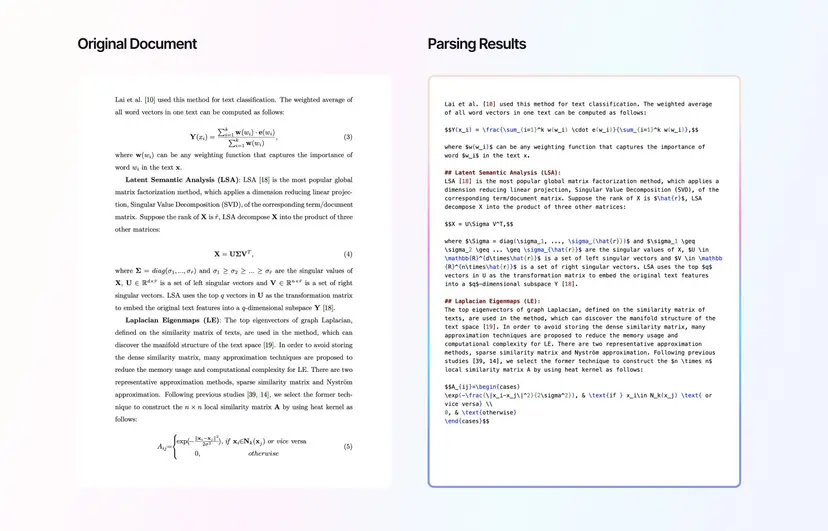

# LlamaParse 在 Arcee AI 的研究論文分析應用案例

## Ref:https://www.llamaindex.ai/blog/case-study-streamlined-research-paper-analysis-with-llamaparse-at-arcee-ai

## 公司簡介
Arcee AI 是一家專門提供企業級 AI 代理解決方案的公司。他們的主打產品 Arcee Orchestra 是一個端到端的 AI 代理解決方案，能夠幫助企業創建用於複雜任務的 AI 代理。該解決方案讓企業能夠輕鬆建立自定義 AI 工作流程，自動將任務分配給專業的小型語言模型(SLM)，從而在客戶的 VPC 內提供詳細且可信的回應，確保資料隱私和合規性。

## 面臨的挑戰
Arcee AI 需要一個可擴展且高效的方案來從數千份 PDF 格式的自然語言處理研究論文中提取信息，以創建新的數據集。這些文件包含複雜的內容，如表格、方程式等，這給提取和數據集創建帶來了重大挑戰。早期嘗試使用開源解決方案雖然提供了一些基本功能，但缺乏 Arcee AI 所需要的智能性和靈活性，特別是在準確提取表格和方程式方面。

## 解決方案：LlamaParse
Arcee AI 整合了 LlamaParse 來處理 PDF 文件，並將輸出用於微調專注於 NLP 研究查詢的特定 LLM。項目範圍涉及解析來自 S3 存儲桶中自 2017 年以來的所有 NLP 研究論文，約 400 萬頁內容。LlamaParse 的表現超越了傳統的 OCR 解決方案和開源替代方案。此外，LlamaParse 的解析指令允許 Arcee AI 通過提示詞來優化任務，顯著提高了解析複雜內容的準確性。

## 實施與成果
初期，Arcee AI 遇到了表格缺失、方程式解析錯誤和偶爾的幻覺輸出等問題。然而，通過反覆調整提示詞，他們逐步改善了輸出質量。LlamaParse 使 Arcee AI 能夠：

- 高效轉換 PDF 文件：提供可靠的轉換過程，最小化數據損失
- 簡化數據集創建：利用工具的靈活性，在更短時間內開發高質量數據集
- 通過提示詞優化提升準確性：智能引擎的適應性允許持續改進複雜數據的解析

## 影響
通過整合 LlamaParse，Arcee AI 徹底改造了其研究論文處理流程。易用性和通過提示詞影響結果的能力使 Arcee AI 能夠達到高標準的準確性和數據完整性。LlamaParse 已成為 Arcee AI 文檔分析過程中的重要工具，為高效研究數據提取設立了新的基準。

## 關於 LlamaParse
LlamaParse 幫助 Arcee AI 簡化了研究數據提取並提升了數據集質量，鞏固了其作為學術研究分析重要資產的地位。這次整合帶來了更高效、更靈活、更準確的複雜 PDF 內容分析流程，證明了 LlamaParse 在推進研究能力方面的價值。

---
*本案例研究譯自 LlamaIndex 官方博客，發布於 2024 年 11 月 25 日*